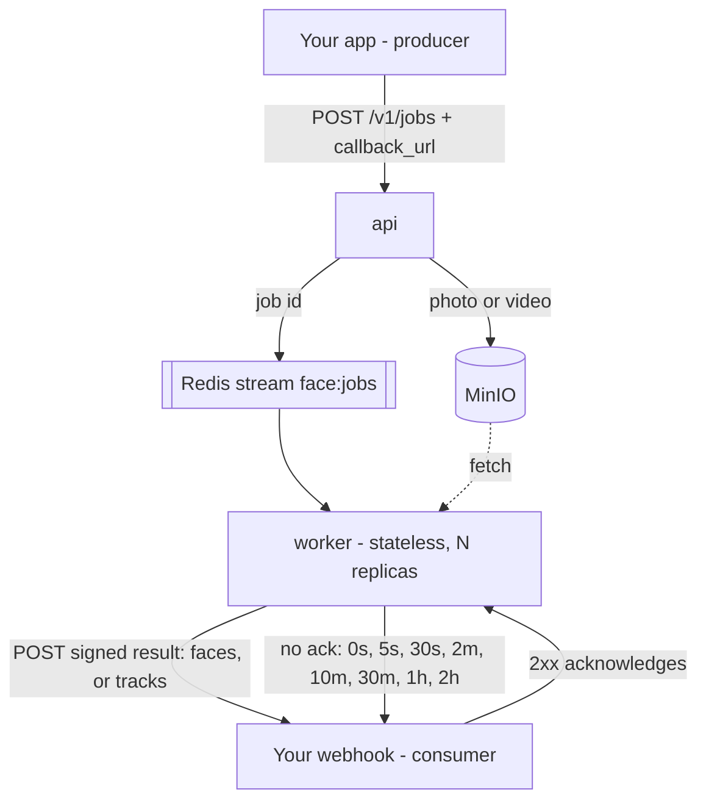

# Face processing

A stateless face-processing microservice (queue in, webhook out) and a Next.js app that uses it.
It groups the faces in photos **and videos** into people. Everything runs in Docker; nothing is
installed on the Mac.

```
face-processing-pipeline/   Python service
  service/                  the microservice: producer API, worker, queue, storage, webhook delivery
  pipeline/                  the processing core: SCRFD detection, ArcFace embeddings, tracking, grouping
  web/                       folder-based test UI, a development helper (http://localhost:8000)
  scripts/                   check_env.py, echo_webhook.py
  data/                      photos in, results out, for the folder-based UI (never committed)
frontend/                   Next.js app (http://localhost:3000)
compose.yaml                api + worker + frontend + Redis + MinIO + Postgres
```

## Run it

```sh
docker compose build app
docker compose up -d api worker frontend          # Redis, MinIO and Postgres start with them
docker compose up -d --scale worker=3 worker      # more consumers, same queue
```

| What | Where |
|---|---|
| Producer API (docs) | http://localhost:8080/docs |
| Next.js app | http://localhost:2001 |
| MinIO console | http://localhost:9001 (minioadmin / minioadmin) |
| Folder-based test UI | http://localhost:8000 |

## The microservice



The service keeps no data of its own: no results table, no per-run state. A job carries everything
the worker needs, and the result goes straight to the caller's webhook. Job bookkeeping and the
pending result live in Redis, so any worker can take over any job.

### Submit a job

```sh
# photo already in the bucket, or any URL the worker can fetch
curl -X POST localhost:8080/v1/jobs -H 'content-type: application/json' -d '{
  "image": {"key": "incoming/abc.jpg"},
  "callback_url": "http://your-app:3000/api/webhooks/faces",
  "metadata": {"photo_id": "p_123"}
}'

# a video: the same call with "video" instead of "image"
curl -X POST localhost:8080/v1/jobs -H 'content-type: application/json' -d '{
  "video": {"key": "incoming/holiday.mp4"},
  "callback_url": "http://your-app:3000/api/webhooks/faces",
  "metadata": {"photo_id": "p_124"}
}'

# or hand over the bytes and let the API store them; it tells photos and videos apart itself
curl -F file=@photo.jpg -F callback_url=http://your-app:3000/api/webhooks/faces \
     -F 'metadata={"photo_id":"p_123"}' localhost:8080/v1/jobs/upload
```

All answer `202 {"job_id": "job_…", "kind": "image"|"video", "status": "queued"}`.
`GET /v1/jobs/{job_id}` reports `queued → processing → delivering → delivered`, or `dead` if the
consumer never acknowledged, along with the attempt count and the last error.

### Receive the result

The worker POSTs this to `callback_url`:

```json
{
  "job_id": "job_f142d02582ae4917bdf8",
  "status": "succeeded",
  "metadata": {"photo_id": "p_123"},
  "image": {"width": 1280, "height": 886},
  "detector": "SCRFD (det_10g.onnx)",
  "embedding_model": "ArcFace (w600k_r50.onnx)",
  "detected": 6,
  "faces": [{"bbox": [...], "landmarks": [[x, y], ...], "det_score": 0.92,
             "quality": 0.81, "is_strong": true, "embedding": [512 numbers]}],
  "took_ms": 1600
}
```

A video answers with **tracks** instead of faces — see [Video](#video) — and everything else about
the contract is the same:

```json
{
  "job_id": "job_bc27a49b892e4252a2ce",
  "kind": "video",
  "status": "succeeded",
  "metadata": {"photo_id": "p_124"},
  "video": {"width": 1280, "height": 720, "duration_ms": 22000, "sampled_frames": 44,
            "sampled_fps": 2.0, "poster": {"key": "stills/job_…/poster.jpg", "width": 1280, "height": 720}},
  "detected": 34,
  "tracks": [{"track": 0, "first_ms": 0, "last_ms": 4500, "frames": 10,
              "faces": [{"at_ms": 2000, "bbox": [...], "quality": 0.79, "is_strong": true, "yaw": 0.12,
                         "embedding": [512 numbers],
                         "still": {"key": "stills/job_…/t0f0.jpg", "width": 362, "height": 361}}]}],
  "took_ms": 6343
}
```

On failure it delivers `{"status": "failed", "error": "..."}` for the same job, so the producer
always hears back. Headers: `x-face-job-id`, `x-face-attempt`, and `x-face-signature`, an
HMAC-SHA256 of the exact body with `WEBHOOK_SECRET`. Verify it before trusting the payload:

```ts
const expected = "sha256=" + crypto.createHmac("sha256", secret).update(rawBody).digest("hex");
const signature = request.headers.get("x-face-signature") ?? "";
const ok = expected.length === signature.length &&
           crypto.timingSafeEqual(Buffer.from(expected), Buffer.from(signature));
```

**Acknowledgement.** Any 2xx closes the job. Anything else, including a timeout, is retried on the
schedule above; the computed result waits in Redis, so a retry re-sends rather than re-processes.
After the last attempt the job is marked `dead` and its id is pushed to the `face:deliveries:dead`
list. Delivery is at-least-once, so treat `job_id` as an idempotency key on your side.

### Settings

`REDIS_URL`, `S3_ENDPOINT`, `S3_BUCKET`, `S3_ACCESS_KEY`, `S3_SECRET_KEY`, `WEBHOOK_SECRET`,
`WEBHOOK_TIMEOUT`, `RETRY_SCHEDULE` (comma-separated seconds), `RESULT_TTL`, `CLAIM_IDLE_MS`.
Defaults are in `service/settings.py`.

## The app (frontend)

```
browser → POST /api/upload → MinIO + POST /v1/jobs → queue → worker
                                                              ↓ signed result
        gallery database ← POST /api/webhooks/faces ←──────────┘
```

The app owns its `gallery` database (Postgres + pgvector, created by the `db-init` service);
the pipeline never touches it.

| Table | What's in it |
|---|---|
| `photos` | object key, file name, `kind` (photo or video), job id, status, width/height, duration, poster key, error |
| `faces` | photo id, person id, bbox, det_score, quality, is_strong, `vector(512)` embedding, and for a video face its track, time and still |
| `people` | just an id, which faces point at |
| `links` | what you have told it: two faces are the `same` person, or `different` people |

A video is a row in `photos` too. Everything that joins faces to people then works on videos
without knowing they exist — which is the whole reason it isn't a table of its own.

Tables and the HNSW cosine index are created on first use by `ensureSchema()` in
`src/db/index.ts`, so there is no migration tool to run.

**Grouping happens twice over.** On arrival, the webhook stores each face and asks pgvector
(`embedding <=> $1`) which people are nearest, ignoring anything from the same photo or video, and
joins the best one — see [Grouping rules](#grouping-rules-and-tuning) for when — so people appear
seconds after an upload. On demand, **Regroup everything** clusters the whole library again from
scratch, which repairs groups that drifted apart. It renumbers people, so person URLs change
after a regroup.

**Webhook safety:** every delivery is checked against the HMAC signature (401 otherwise), and the
handler is idempotent — it replaces a photo's faces instead of appending, because the pipeline
retries until it gets a 2xx.

Settings are in `src/lib/config.ts`: `DATABASE_URL`, `PIPELINE_URL`, `CALLBACK_URL`,
`WEBHOOK_SECRET`, `S3_*`, and the two thresholds `SAME_FACE` and `ATTACH_FACE`.

## The processing core

```
load image (fix rotation) → SCRFD detect → drop tiny faces → align to 112×112 → quality score
→ ArcFace embedding
```

| Module | What it does |
|---|---|
| `pipeline/ingest.py` | Loads a photo from a path or from bytes, the right way up (EXIF, HEIC). |
| `pipeline/detect.py` | SCRFD-10GF: face boxes and 5 landmarks. |
| `pipeline/quality.py` | Size, blur and head angle; marks a face strong or weak. |
| `pipeline/embed.py` | Aligns each face and turns it into 512 ArcFace numbers. |
| `pipeline/video.py` | Decodes a video and hands back a few frames a second, plus the stills. |
| `pipeline/track.py` | Ties one face across frames into an appearance; keeps a few faces of it. |
| `pipeline/cluster.py` | Groups strong faces, attaches weak ones, numbers people by photo count. |
| `pipeline/db.py`, `export.py` | Used only by the folder-based test UI, not by the microservice. |

## Speed on CPU

Measured on this Mac (8 cores, Docker, no GPU) over eight 12-megapixel phone photos.

| change | before | after |
|---|---|---|
| int8 models instead of fp32 | 1521 ms/photo | **574 ms/photo** (261 ms on an idle machine) |
| decode capped at 2048px | 121 ms | 89 ms, same faces |
| one worker with 8 threads | 1470 ms of work | 4 threads × 2 workers: ~1.7× the throughput |

Both models are quantised to int8 when the image is built. They find the same faces (13 of 13,
boxes within 2.3px), embeddings agree with the originals to 0.989, and pairwise similarities move
by at most 0.03, so no grouping decision changes. `MODEL_PRECISION=fp32` switches back.

Three findings behind those settings:

- **Threads stop paying.** 1→2 threads is 1.9×, 2→4 is 1.9×, but 4→8 only 1.2×. Throughput comes
  from more workers, not more threads each: `docker compose up -d --scale worker=2`.
- **A bigger detector input loses faces.** At 1024 or 1280 the detector finds *fewer* faces (11 vs
  13), because large selfie faces overflow its biggest anchor. Overlapping tiles are the way to
  reach small faces instead, and they only run on photos above `TILE_MIN_PIXELS`, since a selfie
  gains nothing from being cut into four.
- **Decoding smaller costs nothing.** libjpeg can decode at 1/2, 1/4 or 1/8 scale and the detector
  works at 640px regardless. `draft()` must be asked for a box with the photo's own shape: it
  reduces by `min(width // asked, height // asked)`, so a square box does nothing to a 4:3 photo.

Settings: `MODEL_PRECISION`, `ORT_THREADS`, `MAX_DECODE_SIDE`, `DETECT_TILES`, `TILE_MIN_PIXELS`.
Videos have their own numbers — see [Video](#video).

## Video

A video's unit is not a face, it is an **appearance**: one person on screen from 0:12 to 0:41 is
one thing to group, not eighty. So the worker samples frames, ties the faces in them into
**tracks**, and delivers a few representative faces per track. The app then treats a track exactly
as it treats a photo's face — match it against the people it already has — and everything
downstream is unchanged.

```
open video from the bucket (range requests, nothing on disk)
  -> sample 2 frames a second   -> SCRFD on each frame -> embed every face
  -> join faces into tracks     -> keep the best few faces of each track, with a still each
  -> one webhook: tracks, times, embeddings
```

**Four decisions, and why.**

- **Sample, don't decode everything.** A face does not change meaningfully in 33 ms. At
  `VIDEO_FPS=2` everyone who appears is still seen, at a thirtieth of the detector's work.
  Decoding is only about 5% of the cost, so frames a second is the knob that matters.
- **Embed every face, not just the kept ones.** Two frames a second is half a second apart, and a
  walking person moves further than their own face in that time, so overlapping boxes are weak
  evidence of who is who. The face itself is strong evidence, and an embedding costs a seventh of
  a detection. Boxes are still used to rescue a face whose embedding went noisy in a blurred
  frame but that plainly stayed put.
- **Deliver a handful of faces per track, not one per frame.** `TRACK_FACES=3`, chosen by
  quality and by being different enough from each other to be worth a slot, so a turned head or a
  change of light is kept and forty near-identical frames are not.
- **A track is one person, decided once.** `assignTrack` matches the track's best face and the
  rest follow it, so a blurred frame of an appearance never has to clear the bar alone, and
  regrouping keeps a track together too.

**Accuracy a video gives for free.** A detection that appears in one sampled frame and never
again is dropped (`MIN_TRACK_FRAMES`): a false box rarely survives half a second, and neither
does a stranger crossing the background. The rule is relaxed for a clip too short to have offered
a second look.

**Speed**, measured on this Mac over a 22-second 720p clip: **6.3 s, about 3.3× real time per
worker**, and it scales with worker count. Decoding all 660 frames was 0.3 s of that; the rest is
detection and embeddings on 44 sampled frames. A ten-minute video is roughly three minutes on one
worker, one minute on three.

**Nothing lands on disk.** `storage.open_object` reads the bucket through range requests and
lets the decoder seek, so a large file costs a few megabytes of traffic rather than its own size,
in the worker and again in the browser: `/api/videos/{id}` passes `Range` straight through, which
is also what makes seeking work.

Settings: `VIDEO_FPS`, `VIDEO_MAX_SIDE` (1280, low enough that a frame takes one detector pass
rather than five), `VIDEO_MAX_SECONDS`, `TRACK_FACES`, `MIN_TRACK_FRAMES`, and the track matching
thresholds in `pipeline/config.py`.

### The funnel, and what filtering it is worth

Every stage of a video job is narrower than the one before, and the result carries the counts so
the shape can be seen for a real file rather than assumed:

```
n frames in the file  ->  sampled at VIDEO_FPS  ->  the gate lets some through
                      ->  face observations     ->  tracks  ->  a few faces each
```

The point of the shape is that complexity stays O(n) — the file has to be read — while the
constant in front of it does not. What matters is therefore where the constant lives, and on this
pipeline it is not where it looks: measured on a 35-second 720x1280 phone video, **decode 9.9%,
detection 66.1%, embedding 24.0%** — 1.45 ms to decode a frame against 107 ms to detect on one.
Filtering only pays if it removes detector passes.

`VIDEO_GATE` chooses what does the filtering. All three were measured over three phone videos,
against running the full detector on every sampled frame:

| gate | people come and go | somebody on screen throughout | short clip |
|---|---|---|---|
| `none` (default) | — | — | — |
| `scout` | **21% faster**, 12 of 13 appearances | 7% slower, all 13 | 4% slower, all 10 |
| `motion` | nothing: every frame passes | nothing | nothing |

- **`motion`** is the frame-difference gate: keep a frame only if it differs from the last one
  kept. On handheld video the measured difference between frames half a second apart is 26 of
  255, so every frame passes at any safe threshold and it saves nothing. It is the right gate for
  a camera that does not move, and the wrong one for a phone.
- **`scout`** runs the same detector at 192px first and lets the full pass through only where it
  saw something — which works because 48% of sampled frames held nobody at all. It is off by
  default because it is not free: it misses faces the full detector finds, and no threshold makes
  it safe. It caught faces that reached it at 5.8px and missed others at 10.5px, since what
  defeats it is blur and contrast, not size.

Because the scout cannot know when it is wrong, it is **checked rather than trusted**: one
rejected frame in four is detected on anyway, and once the full detector has found faces in two
of those the gate stands down for the rest of the video. That is what keeps it honest on footage
it cannot read — on a clip of 36px faces under motion blur it threw away three appearances of
five before the audit was added, and none afterwards.

`TRACK_BY` chooses how a face is followed between frames:

- **`appearance`** (default) matches on the embedding, which means embedding every sighting.
- **`motion`** matches on where the box was and embeds only the few faces each track keeps. It is
  18-31% faster and measurably worse: 8 of 13 appearances survived on one clip, 9 of 10 on
  another, and on a third it cut one person into 19 appearances instead of 13. Two frames a
  second is simply too slow for boxes to overlap — a walking person moves further than their own
  face between samples.

Settings: `VIDEO_GATE`, `SCOUT_INPUT_SIZE`, `SCOUT_THRESHOLD`, `MOTION_GATE_THRESHOLD`, `TRACK_BY`.

**Not built: progressive delivery.** A long video delivers one webhook at the end. Sending a
webhook per segment would show people while the video is still processing, but it turns one
idempotent delivery into a sequence the consumer has to reassemble, and the retry contract has to
become per-segment. Worth doing when videos get long enough to wait for; not before.

## Development helpers

**Folder-based UI** (http://localhost:8000): drop photos in, press **Run pipeline**, and browse the
people it found. Every step appears in the Processing panel on the right; **Face boxes** shows each
photo with its faces boxed and numbered. It writes `data/output/` and uses Postgres, which the
microservice does not.

**Command line:** `docker compose run --rm app python -m pipeline.run` for the folder pipeline, and
`docker compose run --rm app python scripts/check_env.py` to check models and database.

**Stand-in consumer:** `scripts/echo_webhook.py` prints deliveries, verifies the signature and
acknowledges them; `FAIL_TIMES=2` makes it reject the first two attempts so retries can be tested.

**Editor:** open the project with **Dev Containers: Reopen in Container**. VS Code then runs inside
the app container, so imports resolve without installing anything on the Mac. It opens
`face-processing-pipeline/`; edit `frontend/` in a normal window.

## Grouping rules and tuning

**Joining a person is easy, starting one is not.** A face joins someone at 0.45 similarity,
whether it is strong or weak, but to *start* a new person it must be strong and roughly facing
the camera
(`CREATE_MAX_YAW`, default 0.35). Without that asymmetry a single profile shot of a man already in
the library becomes a second person, which is exactly what happened before the rule existed.

**A face may also join whoever it is clearly closest to.** Being close enough is an absolute test,
and absolute tests fail on hard faces. A blurred appearance out of a video scored 0.40 against the
man's own photographs — under the bar — while the nearest *other* person scored 0.10. Nobody
looking at those two numbers would call it undecided. So a face also joins the best candidate when
it clears `MATCH_FLOOR` (0.35) and beats the runner-up by `MATCH_MARGIN` (0.20). The rule needs
somebody to be second, so it never fires in a library with one person in it, where "closer than
anyone else" means nothing.

This is what finds one person across photos *and* video. It also reunited a childhood
black-and-white photograph with the man it belongs to, at 0.38, which twelve years of ageing had
put far below any absolute threshold.

**A person is scored by their closest face, not their average one.** Averaging someone's face
across years, lighting and half-turns blurs the very detail a hard face has to match: over the
test library the closest face beat the average on three appearances out of five.

The same holds when regrouping compares two *groups*, and getting it wrong there was worse. The
clustering used average linkage — the mean similarity between every member of one group and every
member of the other — which sounds more careful and is not. One person across half an hour of
video varies so much that the mean inside their own true group falls under the bar long before
the group is complete, so merging stops with the person in pieces: a clip the matcher had settled
into twelve people came back out of regrouping as sixty-six. Both passes now ask the same
question, the closest pair, and regrouping that same clip gives sixteen.

**Video is judged by video's numbers.** A face in a 720p frame is 34-49px with a blur score of
7-45, where the same people in photos are 102-874px and 198-6929 — the blur score is partly a
measure of resolution, since a 40px face stretched to a 112px crop has no fine detail to find.
Judging a video by the photo numbers threw away two whole appearances that were detected at
0.53-0.65 and would have matched their person at 0.73. Video has `VIDEO_MIN_FACE_SIZE` (24),
`VIDEO_STRONG_FACE_SIZE` (40) and `VIDEO_MIN_BLUR_SCORE` (6) instead, and the junk this lets in is
caught by having to survive more than one sampled frame.

**Two people bridged by one face are one person.** When a new face matches two different people
well enough to join either, they were the same person all along and are merged — unless they share
a photo, which is proof they are not. That is the repair for a person built from photographs and
the same person found in a video, when whichever arrived first was too different to match.

**A person's picture is the cleanest face of them, not the highest-scoring one.** The pipeline's
`quality` measures whether a face is *usable* — confidence times size times how straight the head
is — which is the wrong question for a thumbnail, and it put the back of a head, a profile and a
face half out of frame on the front page. `lib/cover.ts` asks the right one, from what is already
stored: how sharp the face is against the sharpest that person has, how much it looks like the
rest of them (which throws out a hand across a mouth or a face grouped there by mistake), how
straight the head is, how sure the detector was, how big it is in real pixels, and how far it
sits from the edge of the frame. Sharpness is the term that matters most and was the one missing:
without it the score picks the most *typical* face, and in a library of video most of anybody's
faces are mid-motion.

Where a picture still looks poor, it is usually not the choice but the material — a person whose
every face is 30 to 40 pixels has no good picture to choose. Their faces also agree with each
other at 0.3 to 0.5, where a solid group sits at 0.6 to 0.9, which is a useful signal that the
group itself is thin.

**Pictures open in the app, not in a browser tab.** Clicking an appearance opens a viewer over
the gallery: the frame with the face boxed on it, **Play** to watch the clip from the moment that
appearance starts, arrow keys to step through the person's other pictures and Escape to close.
Handing the file to the browser instead loses the gallery, the face you were looking at and the
time it came from, and gives back a bare file in a tab.

**You can say yes, and you can say no.** The suggestions on a person's page — *Might also be this
person* — are the ones the matcher was not sure enough about to act on, and **Same person** settles
one in a click. **not them** on any picture takes it back out into a person of its own. Both are
remembered: a merge as a `same` link and a split as a `different` link, and regrouping honours
both, so neither decision is undone by the next clustering pass. An appearance in a video moves as
a whole, because its frames are one person walking across one clip.

A weak face needed 0.5 until the pairs that landed between the two bars were looked at: they
were the same person almost every time, so the extra 0.05 bought nothing but faces left with
nobody. Dropping it to 0.45 placed 23 more faces across a library of 693 **without creating a
single new person or changing a single group** — the rule that stops people being invented is
that a weak face may never start one, not that it joins reluctantly.

Thresholds live in `frontend/src/lib/config.ts` (`SAME_FACE`, `ATTACH_FACE`, `CREATE_MAX_YAW`,
`MATCH_FLOOR`, `MATCH_MARGIN`, `SUGGEST_FROM`) and `pipeline/config.py` (quality bars, video bars,
`CLUSTER_DISTANCE`, `MIN_PHOTOS_PER_PERSON`). Raise `CLUSTER_DISTANCE` if one person is split
across groups; lower it if different people are mixed.

### Measured

Eight photos holding thirteen faces of three people — plus one black-and-white childhood photo —
with the people labelled by eye off a contact sheet rather than by the embeddings being tested,
and a 33-second 720p video of three of them shot the way a phone shoots: faces 34-49px, motion
blurred, turned away, underlit, blown out, through a 700kbit encoder. Five appearances, known by
construction: A B C B A.

|                                       | before | after |
|---|---|---|
| appearances found (of 5)              | 3 | **5** |
| appearances put with the right person  | 2 | **4** |
| appearances put with a *wrong* person  | 0 | 0 |
| people invented by the video           | 0 | 0 |
| people from the 8 photos               | 4 | **3** |

The appearance still unmatched is the woman at 37px under 11px of motion blur: 0.19 against
herself, 0.09 against the nearest other person. The embedding is genuinely destroyed, the margin
is too thin to act on, and the app leaves it unassigned rather than guess — it shows up under
*Might also be this person* instead.

Separation on this library, which is what the numbers above are chosen against: two faces of the
same person score 0.54 to 0.97, two faces of different people never pass 0.17.

### Measured, and deliberately not changed

- **Detector threshold stays at 0.5.** Across twelve photos every candidate below it was hair, a
  shoulder or blur; the weakest real face scored 0.61. Lowering it buys junk. The exception is
  video, where a false detection has to survive half a second, which it rarely does.
- **More tiles than 2x2 hurt.** 3x3 and 4x4 add false boxes (a rug scored 0.36) without finding
  anyone new.
- **No geometric or magnitude filter.** False boxes have believable landmark geometry (eyes 0.42 of
  the width apart, nose inside, mouth below) and ArcFace vector lengths inside the real range
  (20.0 versus a real minimum of 20.4). Neither separates.
- **Glint360K R100 is not better here.** It raises same-person scores (+0.74 vs +0.70 mean) but
  raises different-people scores more (+0.45 vs +0.37), so the gap that decides grouping narrows,
  at 19x the CPU of the int8 R50.
- **Person centroids are not better than closest faces**, for matching or for regrouping: the
  centroid won on one appearance out of five and lost on three.
- **Averaging a track's kept faces is worth keeping but small**: +0.02 to +0.05 towards the right
  person, never towards a wrong one. Averaging every frame rather than the kept few was no better.

## Notes

- Docker on a Mac can't use the GPU, so everything runs on the CPU: a few photos per second.
- InsightFace's pretrained SCRFD/ArcFace weights (buffalo_l) are for non-commercial research only.
