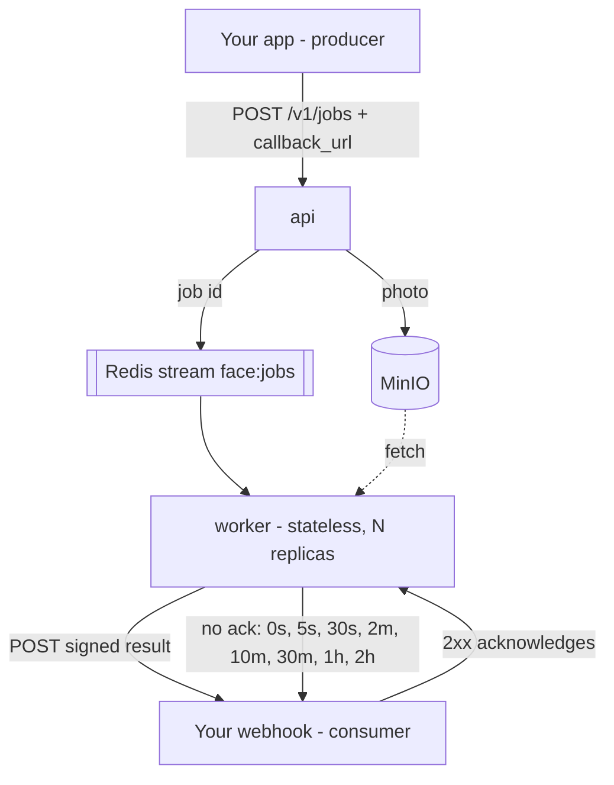

# Face processing

A stateless face-processing microservice (queue in, webhook out) and a Next.js app that uses it.
Everything runs in Docker; nothing is installed on the Mac.

```
face-processing-pipeline/   Python service
  service/                  the microservice: producer API, worker, queue, storage, webhook delivery
  pipeline/                  the processing core: SCRFD detection, ArcFace embeddings, grouping
  web/                       folder-based test UI, a development helper (http://localhost:8000)
  scripts/                   check_env.py, echo_webhook.py
  data/                      photos in, results out, for the folder-based UI (never committed)
frontend/                   Next.js app (http://localhost:3000)
compose.yaml                api + worker + frontend + Redis + MinIO + Postgres
```

## Run it

```sh
docker compose build app
docker compose up -d api worker frontend          # Redis, MinIO and Postgres start with them
docker compose up -d --scale worker=3 worker      # more consumers, same queue
```

| What | Where |
|---|---|
| Producer API (docs) | http://localhost:8080/docs |
| Next.js app | http://localhost:3000 |
| MinIO console | http://localhost:9001 (minioadmin / minioadmin) |
| Folder-based test UI | http://localhost:8000 |

## The microservice



The service keeps no data of its own: no results table, no per-run state. A job carries everything
the worker needs, and the result goes straight to the caller's webhook. Job bookkeeping and the
pending result live in Redis, so any worker can take over any job.

### Submit a job

```sh
# photo already in the bucket, or any URL the worker can fetch
curl -X POST localhost:8080/v1/jobs -H 'content-type: application/json' -d '{
  "image": {"key": "incoming/abc.jpg"},
  "callback_url": "http://your-app:3000/api/webhooks/faces",
  "metadata": {"photo_id": "p_123"}
}'

# or hand over the bytes and let the API store them
curl -F file=@photo.jpg -F callback_url=http://your-app:3000/api/webhooks/faces \
     -F 'metadata={"photo_id":"p_123"}' localhost:8080/v1/jobs/upload
```

Both answer `202 {"job_id": "job_…", "status": "queued"}`.
`GET /v1/jobs/{job_id}` reports `queued → processing → delivering → delivered`, or `dead` if the
consumer never acknowledged, along with the attempt count and the last error.

### Receive the result

The worker POSTs this to `callback_url`:

```json
{
  "job_id": "job_f142d02582ae4917bdf8",
  "status": "succeeded",
  "metadata": {"photo_id": "p_123"},
  "image": {"width": 1280, "height": 886},
  "detector": "SCRFD (det_10g.onnx)",
  "embedding_model": "ArcFace (w600k_r50.onnx)",
  "detected": 6,
  "faces": [{"bbox": [...], "landmarks": [[x, y], ...], "det_score": 0.92,
             "quality": 0.81, "is_strong": true, "embedding": [512 numbers]}],
  "took_ms": 1600
}
```

On failure it delivers `{"status": "failed", "error": "..."}` for the same job, so the producer
always hears back. Headers: `x-face-job-id`, `x-face-attempt`, and `x-face-signature`, an
HMAC-SHA256 of the exact body with `WEBHOOK_SECRET`. Verify it before trusting the payload:

```ts
const expected = "sha256=" + crypto.createHmac("sha256", secret).update(rawBody).digest("hex");
const signature = request.headers.get("x-face-signature") ?? "";
const ok = expected.length === signature.length &&
           crypto.timingSafeEqual(Buffer.from(expected), Buffer.from(signature));
```

**Acknowledgement.** Any 2xx closes the job. Anything else, including a timeout, is retried on the
schedule above; the computed result waits in Redis, so a retry re-sends rather than re-processes.
After the last attempt the job is marked `dead` and its id is pushed to the `face:deliveries:dead`
list. Delivery is at-least-once, so treat `job_id` as an idempotency key on your side.

### Settings

`REDIS_URL`, `S3_ENDPOINT`, `S3_BUCKET`, `S3_ACCESS_KEY`, `S3_SECRET_KEY`, `WEBHOOK_SECRET`,
`WEBHOOK_TIMEOUT`, `RETRY_SCHEDULE` (comma-separated seconds), `RESULT_TTL`, `CLAIM_IDLE_MS`.
Defaults are in `service/settings.py`.

## The app (frontend)

```
browser → POST /api/upload → MinIO + POST /v1/jobs → queue → worker
                                                              ↓ signed result
        gallery database ← POST /api/webhooks/faces ←──────────┘
```

The app owns its `gallery` database (Postgres + pgvector, created by the `db-init` service);
the pipeline never touches it.

| Table | What's in it |
|---|---|
| `photos` | object key, file name, job id, status, width/height, error |
| `faces` | photo id, person id, bbox, det_score, quality, is_strong, `vector(512)` embedding |
| `people` | just an id, which faces point at |

Tables and the HNSW cosine index are created on first use by `ensureSchema()` in
`src/db/index.ts`, so there is no migration tool to run.

**Grouping happens twice over.** On arrival, the webhook stores each face and finds its nearest
neighbour in pgvector (`embedding <=> $1`), ignoring faces from the same photo: above 0.45
similarity it joins that person, while a weak face needs 0.5 and never starts a new person, so
people appear seconds after an upload. On demand, **Regroup everything** re-clusters the library
with average linkage the way the batch pipeline does, which repairs groups that drifted apart. It
renumbers people, so person URLs change after a regroup.

**Webhook safety:** every delivery is checked against the HMAC signature (401 otherwise), and the
handler is idempotent — it replaces a photo's faces instead of appending, because the pipeline
retries until it gets a 2xx.

Settings are in `src/lib/config.ts`: `DATABASE_URL`, `PIPELINE_URL`, `CALLBACK_URL`,
`WEBHOOK_SECRET`, `S3_*`, and the two thresholds `SAME_FACE` and `ATTACH_FACE`.

## The processing core

```
load image (fix rotation) → SCRFD detect → drop tiny faces → align to 112×112 → quality score
→ ArcFace embedding
```

| Module | What it does |
|---|---|
| `pipeline/ingest.py` | Loads a photo from a path or from bytes, the right way up (EXIF, HEIC). |
| `pipeline/detect.py` | SCRFD-10GF: face boxes and 5 landmarks. |
| `pipeline/quality.py` | Size, blur and head angle; marks a face strong or weak. |
| `pipeline/embed.py` | Aligns each face and turns it into 512 ArcFace numbers. |
| `pipeline/cluster.py` | Groups strong faces, attaches weak ones, numbers people by photo count. |
| `pipeline/db.py`, `export.py` | Used only by the folder-based test UI, not by the microservice. |

## Speed on CPU

Measured on this Mac (8 cores, Docker, no GPU) over eight 12-megapixel phone photos.

| change | before | after |
|---|---|---|
| int8 models instead of fp32 | 1521 ms/photo | **574 ms/photo** (261 ms on an idle machine) |
| decode capped at 2048px | 121 ms | 89 ms, same faces |
| one worker with 8 threads | 1470 ms of work | 4 threads × 2 workers: ~1.7× the throughput |

Both models are quantised to int8 when the image is built. They find the same faces (13 of 13,
boxes within 2.3px), embeddings agree with the originals to 0.989, and pairwise similarities move
by at most 0.03, so no grouping decision changes. `MODEL_PRECISION=fp32` switches back.

Three findings behind those settings:

- **Threads stop paying.** 1→2 threads is 1.9×, 2→4 is 1.9×, but 4→8 only 1.2×. Throughput comes
  from more workers, not more threads each: `docker compose up -d --scale worker=2`.
- **A bigger detector input loses faces.** At 1024 or 1280 the detector finds *fewer* faces (11 vs
  13), because large selfie faces overflow its biggest anchor. Overlapping tiles are the way to
  reach small faces instead, and they only run on photos above `TILE_MIN_PIXELS`, since a selfie
  gains nothing from being cut into four.
- **Decoding smaller costs nothing.** libjpeg can decode at 1/2, 1/4 or 1/8 scale and the detector
  works at 640px regardless. `draft()` must be asked for a box with the photo's own shape: it
  reduces by `min(width // asked, height // asked)`, so a square box does nothing to a 4:3 photo.

Settings: `MODEL_PRECISION`, `ORT_THREADS`, `MAX_DECODE_SIDE`, `DETECT_TILES`, `TILE_MIN_PIXELS`.

## Development helpers

**Folder-based UI** (http://localhost:8000): drop photos in, press **Run pipeline**, and browse the
people it found. Every step appears in the Processing panel on the right; **Face boxes** shows each
photo with its faces boxed and numbered. It writes `data/output/` and uses Postgres, which the
microservice does not.

**Command line:** `docker compose run --rm app python -m pipeline.run` for the folder pipeline, and
`docker compose run --rm app python scripts/check_env.py` to check models and database.

**Stand-in consumer:** `scripts/echo_webhook.py` prints deliveries, verifies the signature and
acknowledges them; `FAIL_TIMES=2` makes it reject the first two attempts so retries can be tested.

**Editor:** open the project with **Dev Containers: Reopen in Container**. VS Code then runs inside
the app container, so imports resolve without installing anything on the Mac. It opens
`face-processing-pipeline/`; edit `frontend/` in a normal window.

## Grouping rules and tuning

**Joining a person is easy, starting one is not.** A face joins someone at 0.45 similarity (0.5 if
it is weak), but to *start* a new person it must be strong and roughly facing the camera
(`CREATE_MAX_YAW`, default 0.35). Without that asymmetry a single profile shot of a man already in
the library becomes a second person, which is exactly what happened before the rule existed.

**Merging is remembered.** The merge form on a person's page moves the faces across and records a
link between the two best faces. Regrouping honours those links, so a merge is never undone by the
next clustering pass. That is the fix for faces the model genuinely cannot match: a profile shot,
or someone photographed as a child.

Thresholds live in `frontend/src/lib/config.ts` (`SAME_FACE`, `ATTACH_FACE`, `CREATE_MAX_YAW`) and
`pipeline/config.py` (quality bars, `CLUSTER_DISTANCE`, `MIN_PHOTOS_PER_PERSON`). Raise
`CLUSTER_DISTANCE` if one person is split across groups; lower it if different people are mixed.

### Measured, and deliberately not changed

- **Detector threshold stays at 0.5.** Across twelve photos every candidate below it was hair, a
  shoulder or blur; the weakest real face scored 0.61. Lowering it buys junk.
- **More tiles than 2×2 hurt.** 3×3 and 4×4 add false boxes (a rug scored 0.36) without finding
  anyone new.
- **No geometric or magnitude filter.** False boxes have believable landmark geometry (eyes 0.42 of
  the width apart, nose inside, mouth below) and ArcFace vector lengths inside the real range
  (20.0 versus a real minimum of 20.4). Neither separates.
- **Glint360K R100 is not better here.** It raises same-person scores (+0.74 vs +0.70 mean) but
  raises different-people scores more (+0.45 vs +0.37), so the gap that decides grouping narrows,
  at 19× the CPU of the int8 R50.
- **Verifying weak detections against known people** works as a safety gate, not as extra recall:
  junk matches known people at most 0.12 while real faces reach 0.92, but in this library there
  were no real faces below the threshold to rescue.

## Notes

- Docker on a Mac can't use the GPU, so everything runs on the CPU: a few photos per second.
- InsightFace's pretrained SCRFD/ArcFace weights (buffalo_l) are for non-commercial research only.
